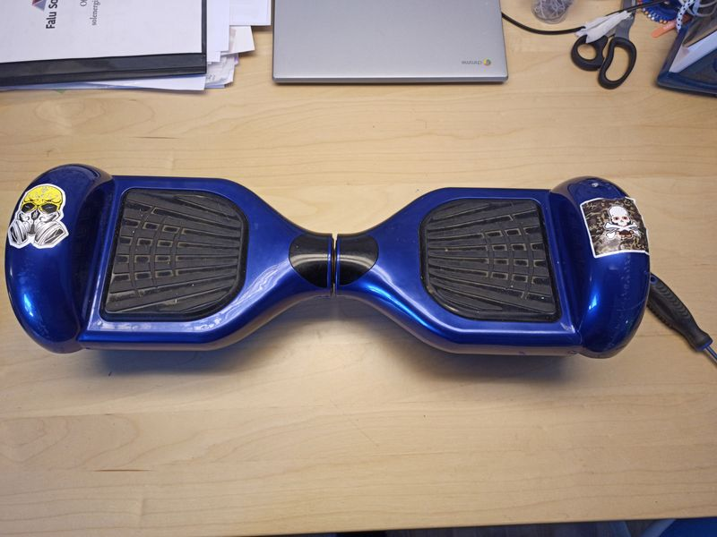
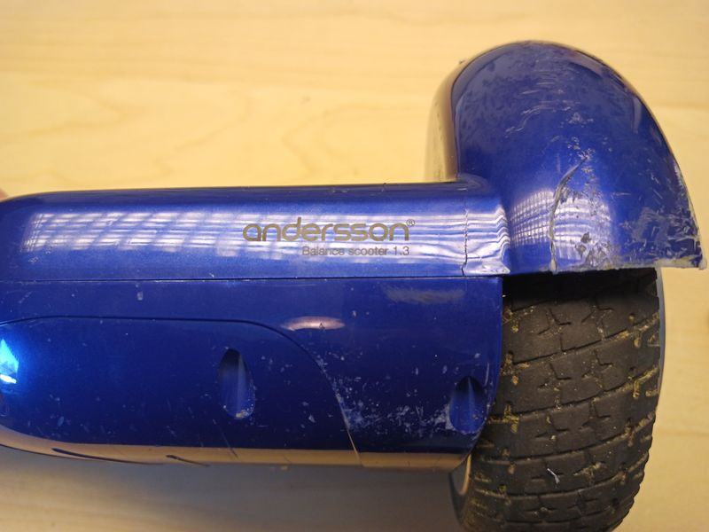
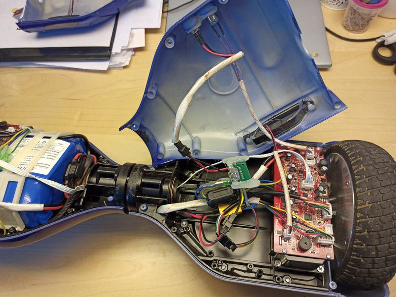
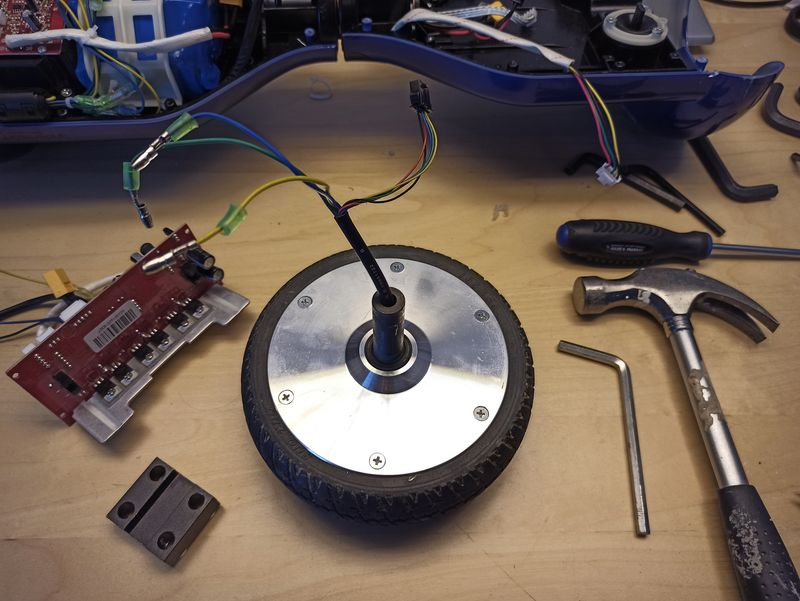
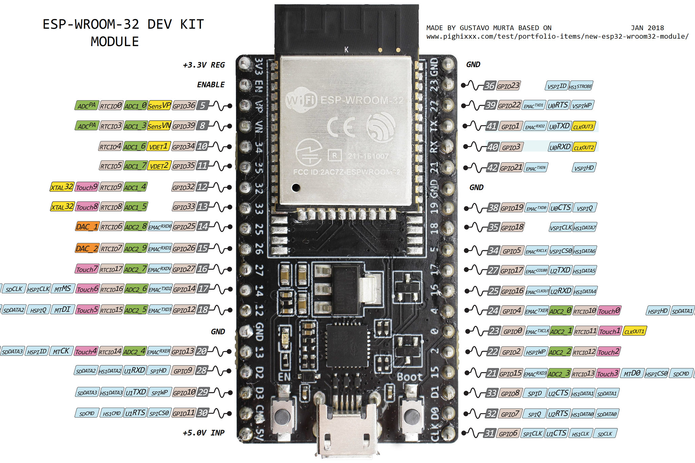
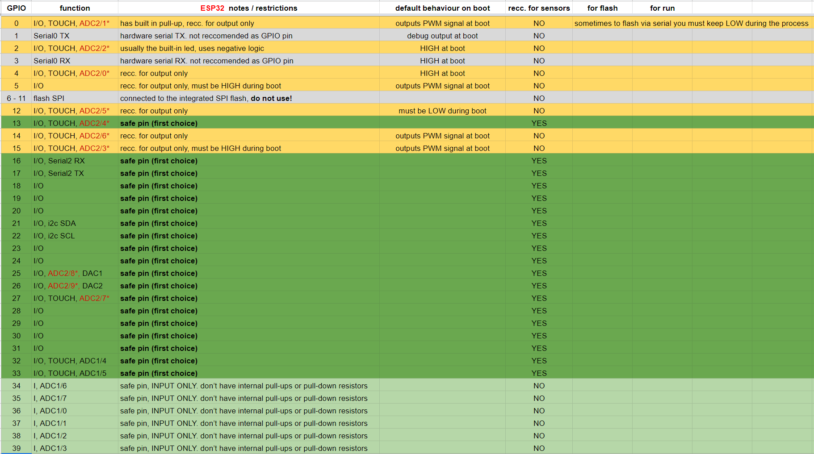

# Dreja
DIY potter's wheel build from a broken hoverboard.

# Hardware
One of the wheel motors from the hoverboard/balance board is user as motor in the potter's wheel. The motor is controlled from a ESP32 via a brushless motor speed controller.

## Bill of materials
The hardware consists of
* Hoverboard, $0-? (I got mine for $30)
* Brushless Motor Speed Controller BLDC Driver Board with Hall (15A 500W DC12V-36V), $12
* ESP32 Development Board, $9
* Power supply (DC36V 10A 360W AC85-265V), $23
* Potentiometer for pedal, $1
* Large bucket
* MDF + Scrap wood

Total cost: $60 (assuming you have the last two items on the list)

## Whishlist
Use the existing controlboard from the hoverboard to control the motor. There is a project that has done this for a different PCB than the one in my hoverboard, maybe it could easily be adapted.

## Assembly
First the motor is extracted from the hoverboard

# Software
Software for the ESP32 is created with PlatformIO and allow speed control via a foot pedal. The ESP also serves up a captive portal that's used for remote monitoring and control.

Pin selection was made using this information.

